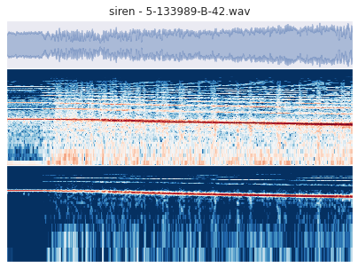

# Environmental-Sound-Classification

###### [Overview](#esc-50-dataset-for-environmental-sound-classification) | [Dataset](#Dataset) | [Repository content](#Repository-Content) | [Results](#Results-Achieved) | [References](#References)

The main purpose of this project will be to provide an efficient way, using machine learning techniques, to classify environmental sound clips belonging to one of the only public available dataset on the internet.  
Several approaches have been tested during the years, but only a few of them were able to reproduce or even overcome the human classification accuracy, that was estimated around 81.30%.  
The analysis will be organized in the following way: since the very first approaches were maily focused on the examination of audio features that one could extract from raw audio files, we will provide a way to collect and organize all those "vector of features" and use them to distinguish among different classes. Then, different classification architectures and techniques will be implemented and compared among each other, in order also to show how they react to different data manipulation (overfitting, numerical stability,...). 
In the end, it will be shown that all those feature classifiers, without exceptions, underperform when compared to the results provided by the use of Convolutional Neural Networks directly on audio signals and relative spectrograms (so without any kind of feature extraction), and how this new approach opened for a large number of opportunities in term of models with high accuracy in sound classification.

### Dataset

One of the main obstacle in research activities focused on environmental sound classification was the scarcity of large public datasets to exploit to train our networks. 
Luckily, a few years ago, thank to the work of [Karol J. Piczak](https://github.com/karolpiczak/ESC-50), form the University of Warsav, a set of 2000 recordings from the Freesound.org project, representing 50 classes of various common sounds, were collected and correctly labeled, forming one the first accessible dataset for this kind of problems. A large number of papers have been written in the last years, each of them proposing a new and more efficient approach to classify those kind of clips, even surpassing the human classification accuracy. In this notebook we will try to do the same: first analyzing some of the audio features that we can extract from the tracks, that can be used to distinguish among various classes, and then implementing a multivariate analysis technique, like neural networks.

The ESC-50 dataset is a labeled collection of 2000 environmental audio recordings suitable for benchmarking methods of environmental sound classification.

The dataset consists of 5-second-long recordings organized into 50 semantical classes (with 40 examples per class) loosely arranged into 5 major categories:

| Animals | Natural soundscapes & water sounds  | Human, non-speech sounds | Interior/domestic sounds | Exterior/urban noises |
| :--- | :--- | :--- | :--- | :--- |
| Dog | Rain | Crying baby | Door knock | Helicopter |
| Rooster | Sea waves | Sneezing | Mouse click | Chainsaw |
| Pig | Crackling fire | Clapping | Keyboard typing | Siren |
| Cow | Crickets | Breathing | Door, wood creaks | Car horn |
| Frog | Chirping birds | Coughing | Can opening | Engine |
| Cat | Water drops | Footsteps | Washing machine | Train |
| Hen | Wind | Laughing | Vacuum cleaner | Church bells |
| Insects (flying) | Pouring water | Brushing teeth | Clock alarm | Airplane |
| Sheep | Toilet flush | Snoring | Clock tick | Fireworks |
| Crow | Thunderstorm | Drinking, sipping | Glass breaking | Hand saw |

Clips in this dataset have been manually extracted from public field recordings gathered by the **[Freesound.org project](http://freesound.org/)**. The dataset has been prearranged into 5 folds for comparable cross-validation, making sure that fragments from the same original source file are contained in a single fold.

A more thorough description of the dataset is available in the original [paper](http://karol.piczak.com/papers/Piczak2015-ESC-Dataset.pdf) , while the main folder of the project can be found on [github](https://github.com/karolpiczak/ESC-50).

### Repository Content

- [`Analysis_of_Sound_Features.ipynb`](Analysis_of_Sound_Features.ipynb) Notebook 1: presentation of the dataset, analysis of the sound clips contained in ESC50, preprocessing and augmentation of the audio tracks and preliminar presentation and analysis of the features that will represent our data in the successive classification tasks.

- [`Features_Classification.ipynb`](Features_Classification.ipynb) Notebook 2: implementation and comparison of several machine learning methods (Random Forests, KNeighbors classifiers, Multi-Layer-Perceptrons, Support Vector Machines and Neural Networks) for the classification of the clips represented as "vectors of features".

- [`Classification_via_CNN.ipynb`](Classification_via_CNN.ipynb) Notebook 3: classification of spectrograms using Convolutional Neural Networks (work in progress) 

- [`Notebook1.py`](Notebook1.py) Collection of several utility functions implemented in the first notebook but that appear to be useful also in the successive ones.

### Results Achieved

To summarize all the results that we have achieved:

* features vectors methods are much faster and less memory demanding with respect to the others, even if they are quite limited in term of the classification accuracy that can be achieved;

* thanks to the preprocessing pipeline, and the nested cross validation implemented, we effectively managed to overcome the highest accuracy value reported in Piczak's Github page not exploiting Convolutional networks (FFN 70.60% > 64.30 RNN + MLP);

* we didn't manage to overcome the human classification accuracy (81.30%) even exploiting CNN; however, we definitely proved that traditional image augmentation techniques bring to better results than augmenting directly the audio clips.
